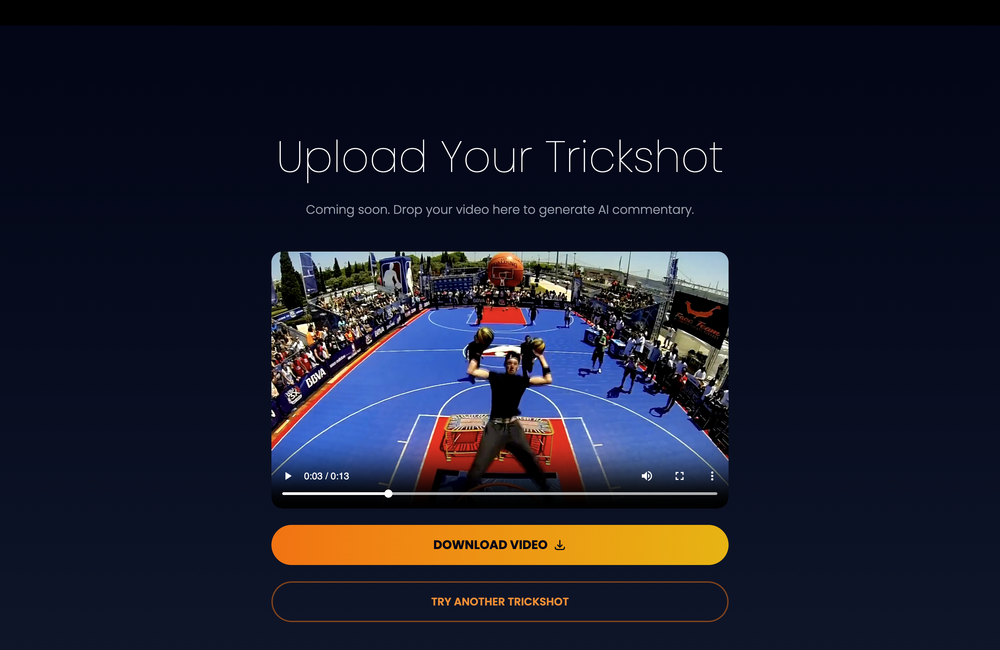

# 🏀 From the Sidelines

**Turn your backyard trickshots into NBA-style commentary with AI.**

An AI-powered web app that analyzes your basketball trickshot videos and generates hyped-up sports commentary with crowd audio. Upload a video. Watch the magic happen. Share the glory.

---

## 🎬 Preview

### Landing Page


### Upload & Commentary Generation


---

## ✨ What It Does

Ever hit an insane shot and wish you had an ESPN commentator narrating it? **From the Sidelines** makes it happen.

Just upload your trickshot video and the app:
1. **Analyzes** your video to understand what happened
2. **Generates** a custom sports commentary script 
3. **Creates** audio with an AI sports announcer voice
4. **Adds** crowd cheering and applause
5. **Delivers** your video with professional commentary overlaid

The result? Your backyard basketball moment sounds like prime-time ESPN.

---

## 🚀 Features

- **One-Click Processing** - Upload, click, and get your commentated video back
- **AI Video Analysis** - Powered by 12Labs to understand your trickshot
- **Hype Commentary** - Generated with Google Gemini for authentic sports commentary
- **AI Voice Actor** - ElevenLabs "Chris the Sports Commentator" voice
- **Crowd Audio** - Real arena atmosphere with cheering, clapping, and chanting
- **Download Ready** - Export and share directly to social media
- **Modern UI** - Beautiful, responsive design with smooth animations

---

## 🏗️ Tech Stack

### Frontend
- **React** - Component-based UI
- **TypeScript** - Type-safe development
- **Tailwind CSS** - Utility-first styling
- **Poppins Font** - Bold, modern typography

### Backend
- **FastAPI** - High-performance Python API
- **FFmpeg** - Professional video processing
- **12Labs API** - Video understanding & analysis
- **Google Gemini** - AI script generation
- **ElevenLabs** - Text-to-speech voice acting
- **Python** - Core backend logic

---

## 📋 Prerequisites

### For Frontend
- Node.js 16+
- npm or yarn
- A modern web browser

### For Backend
- Python 3.9+
- FFmpeg (for video processing)
- API Keys:
  - **12Labs** (for video analysis)
  - **Google Gemini** (for script generation)
  - **ElevenLabs** (for voice generation)

---

## 🛠️ Installation

### Backend Setup

1. **Clone the repository**
```bash
git clone <repo-url>
cd from-the-sidelines
```

2. **Create a Python virtual environment**
```bash
python3 -m venv .venv
source .venv/bin/activate  # On Windows: .venv\Scripts\activate
```

3. **Install dependencies**
```bash
pip install fastapi uvicorn python-multipart python-dotenv twelvelabs google-genai requests
```

4. **Install FFmpeg**
```bash
# macOS
brew install ffmpeg

# Ubuntu/Debian
sudo apt-get install ffmpeg

# Windows
choco install ffmpeg
```

5. **Set up environment variables**
Create a `.env` file in the project root:
```
TWELVELABS_API_KEY=your_12labs_key
INDEX_ID=your_12labs_index_id
GEMINI_API_KEY=your_gemini_key
ELEVENLABS_API_KEY=your_elevenlabs_key
```

6. **Run the backend**
```bash
python3 app.py
```
The API will be running at `http://localhost:8000`

### Frontend Setup

1. **Navigate to the frontend directory**
```bash
cd frontend
```

2. **Install dependencies**
```bash
npm install
```

3. **Update API endpoint** (if different)
Edit `UploadVideo.tsx`:
```typescript
const response = await fetch("http://localhost:8000/generate-commentary", {
```

4. **Run the development server**
```bash
npm run dev
```
Open `http://localhost:5173` in your browser

---

## 📱 How to Use

1. **Visit the app** - Go to the landing page
2. **Scroll down** - Click "TRY IT NOW" to reach the upload section
3. **Upload your video** - Drag and drop or click to select
4. **Generate commentary** - Click "GENERATE COMMENTARY" and wait
5. **Watch & download** - Play the result and download your commentated video
6. **Share** - Post to TikTok, Instagram, YouTube Shorts, etc.

---

## 🔧 Project Structure

```
from-the-sidelines/
├── backend/
│   ├── app.py                 # Main FastAPI app
│   ├── trickshot_summary.py   # 12Labs video analysis
│   ├── commentator_script.py  # Gemini script generation
│   ├── tts_chris.py           # ElevenLabs voice generation
│   ├── eleven_sfx.py          # ElevenLabs crowd audio
│   ├── video_processor.py     # FFmpeg video processing
│   └── .env                   # API keys (not in repo)
│
├── frontend/
│   ├── src/
│   │   ├── App.tsx            # Main app component
│   │   ├── UploadVideo.tsx    # Upload & process component
│   │   └── index.css          # Global styles
│   ├── index.html
│   └── vite.config.ts
```

---

## 🎯 Pipeline Overview

```
Video Upload
    ↓
12Labs Analysis (Video Understanding)
    ↓
Gemini (Commentary Script Generation)
    ↓
ElevenLabs TTS (Voice Generation)
    ↓
ElevenLabs SFX (Crowd Audio)
    ↓
FFmpeg (Audio Overlay & Processing)
    ↓
Download Your Commentated Video
```

---

## 📊 API Endpoints

### POST `/generate-commentary`
Upload a video and get back a commentated version.

**Request:**
```bash
curl -X POST \
  -F "video=@trickshot.mp4" \
  http://localhost:8000/generate-commentary \
  --output result.mp4
```

**Response:**
- `200 OK` - Returns MP4 video file with commentary

### GET `/health`
Health check endpoint.

**Response:**
```json
{"status": "ok"}
```

---

## ⚙️ Configuration

### Video Processing
- Output format: H.264 video, AAC audio
- Resolution: Maintains original input resolution
- Bitrate: Optimized for web (1200-1500 kbps)

### Commentary Audio
- Voice: ElevenLabs "Chris" voice
- Duration: ~5-10 seconds (auto-generated based on video)
- Stability: 0.55 | Similarity Boost: 0.85

### Crowd Audio
- Duration: 8.7 seconds
- Mix: Fade in, 25% volume (mixed with commentary)
- Content: Arena cheering, clapping, chanting

---

## 🎨 Customization

### Change the Commentator Voice
Edit `tts_chris.py`:
```python
CHRIS_VOICE_ID = "your_new_voice_id"
```

### Change Crowd Audio Prompt
Edit `app.py`:
```python
crowd_prompt = "Your custom crowd audio description"
```

### Customize UI Colors
Edit `App.tsx` - Change orange/yellow gradients in Tailwind classes:
```tsx
className="from-orange-500 to-yellow-500"
```

---

## 🐛 Troubleshooting

### "FileNotFoundError: ffmpeg not found"
- Install FFmpeg (see Prerequisites section)
- Verify it's in your system PATH: `ffmpeg -version`

### "CORS Error" when uploading
- Make sure the backend is running with CORS enabled
- Check that the fetch URL in `UploadVideo.tsx` matches your backend URL

### "API Key Error"
- Verify all keys in `.env` file are correct
- Check that 12Labs INDEX_ID is set
- Ensure you have API credits available

### Video processing takes too long
- This is normal for 10+ second videos
- 12Labs analysis: 30-60 seconds
- Gemini generation: 5-10 seconds
- Audio generation: 10-30 seconds
- Total: 1-2 minutes typical

---

## 🚀 Deployment

### Deploying Backend
The backend can be deployed to:
- **Heroku** (with FFmpeg buildpack)
- **AWS Lambda** (with custom runtime)
- **Render** (simple Python deployment)
- **DigitalOcean** (via Docker)

Example Heroku deployment:
```bash
heroku create your-app-name
git push heroku main
```

### Deploying Frontend
The frontend can be deployed to:
- **Vercel** (recommended for Vite)
- **Netlify**
- **GitHub Pages**
- **AWS Amplify**

Example Vercel deployment:
```bash
npm install -g vercel
vercel
```

---

## 📄 License

This project is open source. Feel free to use, modify, and distribute.

---

## 🙏 Credits

Built with:
- **12Labs API** - Video understanding
- **Google Gemini** - AI script generation
- **ElevenLabs** - Voice and sound effects
- **FastAPI** - Backend framework
- **React** - Frontend framework

---

## 📧 Support

Have questions or run into issues?
- Check the troubleshooting section above
- Review the API documentation at `http://localhost:8000/docs`
- Open an issue on GitHub

---

## 🎬 What's Next?

Upcoming features:
- Multiple commentary styles (play-by-play, hype, analysis)
- Video trimming & editing
- Custom background music
- Social media direct upload (TikTok, Instagram)
- Commentary history & collection
- Shareable links for videos

---

**From the Sidelines** - Because every trickshot deserves an ESPN moment. 🏀🎙️
